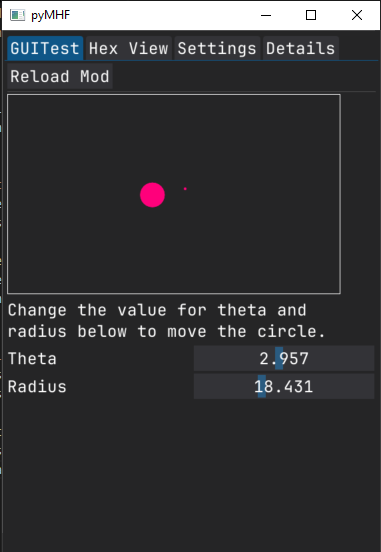

Custom Widgets
==============

As well as the collection of built-in widget types provided by pyMHF, it is possible to create completely custom widgets which can be bound to mods.
Doing so is reasonably complicated, but it provides a lot of power, so may be worth the effort!

Creating a custom widget
------------------------

To create a custom widget, you need to create a class which inherits :py:class:`~pymhf.gui.widgets.CustomWidget`.
This class is an `Abstract base class <https://docs.python.org/3/library/abc.html>_`, meaning is has a few methods which must be defined on the subclass before python will let it be instantiated.

Required methods
~~~~~~~~~~~~~~~~

    - ``draw(self)``

        This is the main draw command which will be called once when the widget it to be drawn for the
        first time. This should create any DearPyGUI widgets which are to be drawn as part of this, as well as creating any variables and binding any callbacks.
        Almost any DearPyGUI commands relating to creating widgets should be able to be put here (within reason!).
        It is generally recommended that any widgets which are created here have their DearPyGUI ids stored in the ``self.ids`` dictionary associated with the class as they will get cleaned up by default if the widget is removed.

    - ``redraw(self, **kwargs) -> dict[str, Any]``:

        Redraw the widget.

        This will be called each frame but is guaranteed not to be called before the original ``draw`` method.

        This method can be defined with any number of arguments but the function decorated by this class MUST return a dict which doesn't contain any keys which aren't function arguments.
        If this decorated a property which also has a setter, the returned dictionary (if any) is passed into that setter by value (ie. it's not spread out - the values must be unpacked from the dictionary inside the setter).

    See the :ref:`example below <custom_widget_mod_code>` on how these two methods work and can be implemented.

Widget behaviour
~~~~~~~~~~~~~~~~

To make handling the placement of custom widgets as simple as possible, pyMHF defines a few types of "widget behaviours" which a custom widget may have.

These behaviours are either "continuous" or "separate"

- **Continuous**:
    The widget will be rendered in a row in the existing table which widgets are placed in if possible.

    This table consists of 2 columns, so if you custom widget would nicely fit into a 2 column format (eg. label in left column, entry field in right), then it's recommended that you use this behaviour to make the UI look more seamless.

- **Separate**:
    For a "separate" widget, it will force any existing table to be ended and create a new group for the custom widget to be rendered in. This gives you complete flexibility in what you want to render, however you will need to control the widget of the widget yourself as it will not automatically fill the space horizontally.

    This is due to drawlists in DearPyGUI not expanding automatically and breaking if you put them in a group of width -1 which would normally allow a widget to expand to take up the full width.

We define the widget behaviour at the top of the custom widget implementation as follows:

.. code-block:: python

    from pymhf.gui.widgets import CustomWidget, WidgetBehaviour

    class MyWidget(CustomWidget):
        widget_behaviour = WidgetBehaviour.SEPARATE

Example
-------

The following example has some extra complexity in handling the click events on the drawlist due to some limitations of DearPyGUI.

.. _custom_widget_mod_code:

.. code-block:: python
    :caption: custom_widget.py
    :linenos:

    import math

    import dearpygui.dearpygui as dpg

    from pymhf import Mod
    from pymhf.gui.decorators import FLOAT
    from pymhf.gui.widgets import CustomWidget, WidgetBehaviour

    class MovingCircle(CustomWidget):
        # Specify that the widget will be drawn separately from the previous widget.
        widget_behaviour = WidgetBehaviour.SEPARATE

        def __init__(self, colour: tuple[int, int, int, int] = (255, 0, 0, 255)):
            super().__init__()
            self.colour = colour
            self.center_pos = (200, 200)
            self.clicked_on = False

        def click_callback(self, sender, app_data, user_data):
            self.clicked_on = True

        def release_mouse(self, sender, app_data, user_data):
            self.clicked_on = False

        def draw(self):
            # Create a DearPyGUI drawlist to draw a circle which follows the mouse when clicked.
            # This code is called when the widget is initially drawn in the GUI and when the
            # widget is reloded after the "reload" button is pressed.
            with dpg.drawlist(width=500, height=300) as dl:
                self.ids["DRAWLIST"] = dl
                self.ids["BORDER"] = dpg.draw_rectangle(
                    pmin=(0, 0),
                    pmax=(500, 300),
                    color=(255, 255, 255, 255),
                    fill=(0, 0, 0, 0),
                    thickness=1,
                )
                self.ids["DOT"] = dpg.draw_circle(
                    center=self.center_pos,
                    radius=2,
                    color=self.colour,
                    fill=self.colour,
                )
                self.ids["CIRCLE"] = dpg.draw_circle(
                    center=(self.center_pos[0] + 100, self.center_pos[1] + 100),
                    radius=20,
                    color=self.colour,
                    fill=self.colour,
                )
            dpg.add_text("Change the value for theta and \nradius below to move the circle.")

            with dpg.item_handler_registry() as ihr:
                # Triggers for the left mouse button clicked event within the drawlist bounds
                dpg.add_item_clicked_handler(
                    button=dpg.mvMouseButton_Left,
                    callback=self.click_callback,
                )

            dpg.bind_item_handler_registry(self.ids["DRAWLIST"], ihr)

            with dpg.handler_registry():
                dpg.add_mouse_release_handler(callback=self.release_mouse)

        def redraw(self, theta: float, radius: float, center_pos: tuple[float, float]):
            # This function is called each frame the tab the widget belongs to is selected.
            if self.clicked_on:
                self.center_pos = tuple(dpg.get_drawing_mouse_pos())
            elif center_pos:
                self.center_pos = center_pos
            x = self.center_pos[0] + 50 * math.cos(theta)
            y = self.center_pos[1] + 50 * math.sin(theta)

            # Update the circle's position using configure_item
            dpg.configure_item(self.ids["DOT"], center=self.center_pos)
            dpg.configure_item(self.ids["CIRCLE"], center=(x, y), radius=radius)
            return {"center_pos": self.center_pos}

    class GUITest(Mod):
        __author__ = "monkeyman192"
        __description__ = "Test globals"

        def __init__(self):
            super().__init__()
            self._theta = 0
            self._radius = 10
            self.center_pos = (200, 200)

        @property
        @MovingCircle((255, 0, 123, 255))
        def circle_loc(self):
            return {
                "theta": self._theta,
                "radius": self._radius,
                "center_pos": self.center_pos
            }

        @circle_loc.setter
        def circle_loc(self, value):
            self.center_pos = value["center_pos"]

        @property
        @FLOAT("Theta", is_slider=True, min_value=0, max_value=2 * math.pi)
        def theta(self):
            return self._theta

        @theta.setter
        def theta(self, value):
            self._theta = value

        @property
        @FLOAT("Radius", is_slider=True, min_value=0, max_value=50)
        def radius(self):
            return self._radius

        @radius.setter
        def radius(self, value):
            self._radius = value

The above code will produce a gui like the following:

If we click on anywhere within the border the smaller dot will follow the location of the mouse, and if we drag the theta or radius sliders, the location and size of the larger dot will change.

Let's break down the above code to see what is going on to get a better idea of what is happening.

We create the ``MovingCircle`` class which inherits from :py:class:`~pymhf.gui.widgets.CustomWidget`